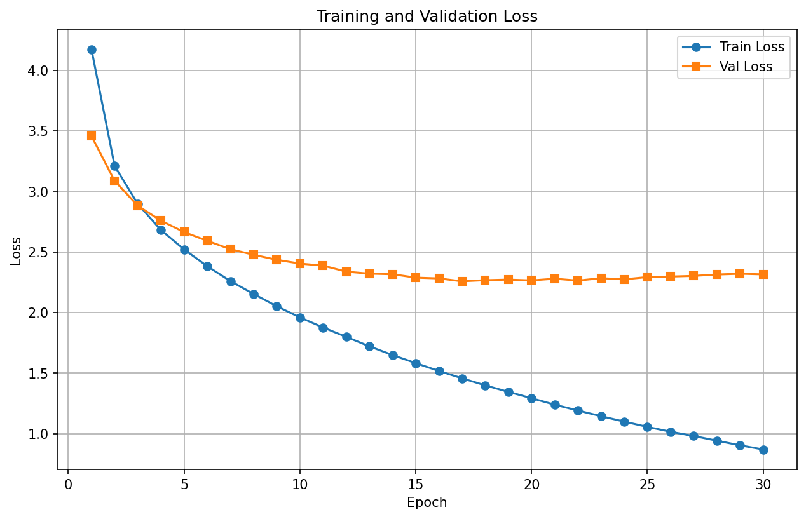

# Mini Transformer from Scratch 

A complete Transformer implementation from scratch for English-to-Japanese translation, built for educational purposes.

## Author

**Zuofan**
- GitHub: [zuofan](https://github.com/zuofanF)
- Focus: NLP, Machine Learning

---

If you found this helpful, please star the repository!🌟


---

## Features

- 🔧 **Pure PyTorch implementation** - No `nn.Transformer`, everything from scratch
- 📚 **Clear code structure** - Well-commented and educational
- 🎯 **Working translation model** - Trained on Tatoeba EN-JP dataset
- 📊 **Training visualization** - Loss curves and metrics
- 🚀 **GPU support** - Fast training on Google Colab

## Architecture

### Core Components

1. **Scaled Dot-Product Attention**
   - Self-attention mechanism
   - Mask support (padding & causal)

2. **Multi-Head Attention**
   - 8 parallel attention heads
   - Dimension: 256 / 8 = 32 per head

3. **Encoder** (3 layers)
   - Multi-Head Self-Attention
   - Feed-Forward Network (256 → 512 → 256)
   - Layer Normalization & Residual Connections

4. **Decoder** (3 layers)
   - Masked Self-Attention
   - Cross-Attention (Encoder-Decoder)
   - Feed-Forward Network
   - Layer Normalization & Residual Connections

## Training Results

### Loss Curves



- **Train Loss**: 4.2 → 0.9 (30 epochs)
- **Val Loss**: 3.5 → 2.3 (plateaus at ~15 epochs)
- **Training time**: ~5 minutes on Tesla T4 GPU

### Translation Examples
```
English:  i love you
Japanese: 私は大好きです。 ✅

English:  how are you
Japanese: 元気ですか。 ✅

English:  thank you
Japanese: お腹がとう。 ⚠️

English:  good morning
Japanese: よくやった。 ❌
```

**Accuracy**: 2/5 perfect, 1/5 acceptable

## 🚀 Quick Start

### 1. Install Dependencies
```bash
pip install -r requirements.txt
```

### 2. Train the Model
```bash
python src/train.py
```

Or use Google Colab (recommended for GPU):
- Open `notebooks/train_colab.ipynb`
- Upload to Google Colab
- Run all cells

### 3. Test Translation
```bash
python src/translate.py
```

## 📦 Dataset

- **Source**: [Tatoeba Project](https://tatoeba.org/)
- **Language Pair**: English → Japanese
- **Training samples**: 10,000 sentence pairs
- **Vocab size**: 
  - English: ~2,891 tokens
  - Japanese: ~1,523 characters (character-level)

## 🛠️ Technical Details

### Model Hyperparameters
```python
d_model = 256        # Model dimension
num_heads = 8        # Attention heads
num_layers = 3       # Encoder/Decoder layers
d_ff = 512          # Feed-forward dimension
dropout = 0.1       # Dropout rate
max_seq_len = 100   # Maximum sequence length
```

### Training Configuration
```python
batch_size = 32
learning_rate = 0.0001
optimizer = Adam (β1=0.9, β2=0.98, ε=1e-9)
epochs = 30
```

## 📈 Performance Analysis

### Observations

1. **Fast convergence**: Loss drops rapidly in first 15 epochs
2. **Overfitting**: Train loss (0.9) << Val loss (2.3)
3. **Early stopping**: Should stop at epoch ~15

### Improvements

- ✅ Add early stopping
- ✅ Increase dropout (0.1 → 0.3)
- ✅ More training data (10K → 50K)
- ✅ Data augmentation
- ✅ Beam search decoding

## 📚 Learning Resources

This project was built following the paper:
- [Attention Is All You Need](https://arxiv.org/abs/1706.03762) (Vaswani et al., 2017)

## 🎓 Educational Purpose

This project is designed for:
- Understanding Transformer architecture
- Learning PyTorch implementation
- Practicing machine translation
- Preparing for ML/AI interviews

## 📄 License

MIT License

## 🙏 Acknowledgments

- Tatoeba Project for the dataset
- Google Colab for free GPU access
- The original Transformer paper authors
